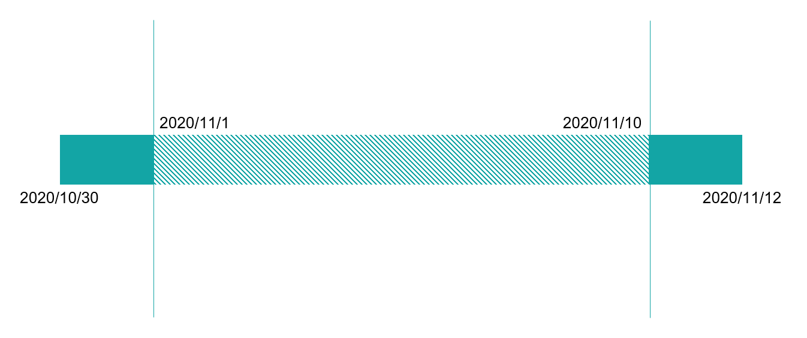
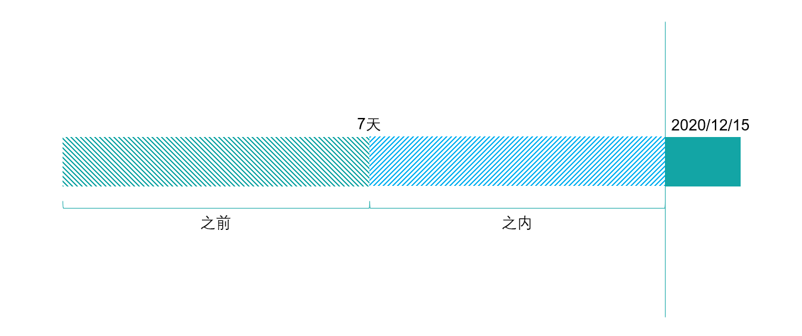
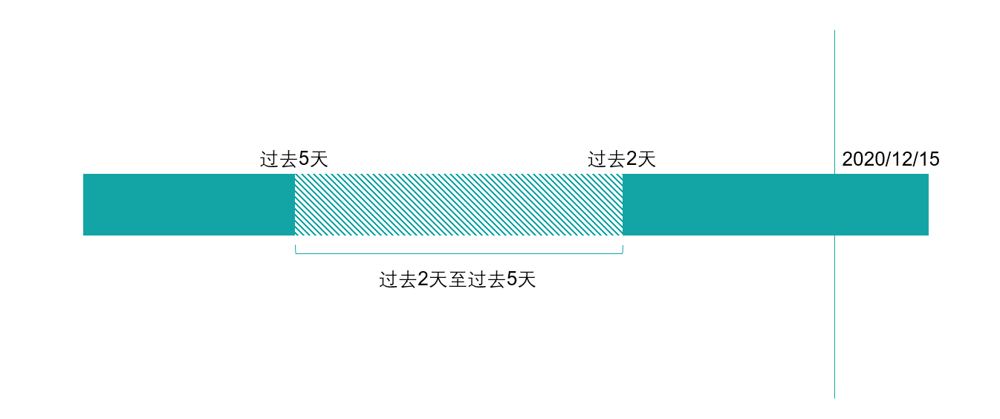

# 属性筛选

## 属性筛选的分类

属性筛选主要分为**行为属性筛选**与**用户属性筛选**两种类型：


**行为属性筛选：**行为属性指的是用户在使用产品过程中，触发的行为携带的属性，例如在**支付订单**行为中，携带的**订单金额**属性，即为行为属性。

**用户属性筛选：**用户属性指的是用户本身的属性，例如用户的**性别**，**累计消费金额**就属于用户属性。


属性筛选属于通用组件，各处的筛选条件逻辑计算规则相同。

## 属性筛选的逻辑计算规则

属性筛选的基本结构为**属性名-逻辑关系-对应值**的三段式结构，根据属性名**数据类型**的不同，其可以选择的**逻辑关系**也有所不同，数据类型共分为**字符串类型**，**数值类型**，**布尔类型**，**日期时间类型**，**字符串集合类型**五种，下面将逐个介绍各个不同数据类型的筛选计算规则。

### 字符串类型

#### 示例数据

| 数据列名 | A        | B        | C        | D        | E    | F    |
| ---- | -------- | -------- | -------- | -------- | ---- | ---- |
| 事件名  | 支付订单     | 支付订单     | 支付订单     | 支付订单     | 支付订单 | 支付订单 |
| 商品名称 | Iphone11 | Iphone12 | Xiaomi10 | Xiaomi11 |      | NULL |

#### 计算规则

| 逻辑关系  | 结构             | 举例                 | 返回结果         |
| ----- | -------------- | ------------------ | ------------ |
| 等于    | 属性名-等于-属性值     | 商品名称-等于-Iphone12   | 数据列**B**     |
| 不等于   | 属性名-不等于-属性值    | 商品名称-不等于-Iphone12  | 数据列**ACDEF** |
| 包含    | 属性名-包含-属性值     | 商品名称-包含-Xiaomi     | 数据列**CD**    |
| 不包含   | 属性名-不包含-属性值    | 商品名称-不包含-Xiaomi    | 数据列**ABEF**  |
| 有值    | 属性名-有值         | 商品名称-有值            | 数据列**ABCDF** |
| 没值    | 属性名-没值         | 商品名称-没值            | 数据列**E**     |
| 为空    | 属性名-为空         | 商品名称-为空            | 数据列**F**     |
| 不为空   | 属性名-不为空        | 商品名称-不为空           | 数据列**ABCDE** |
| 正则匹配  | 属性名-正则匹配-正则表达式 | 商品名称-正则匹配-^Iphone  | 数据列**AB**    |
| 正则不匹配 | 属性名-正则匹配-正则表达式 | 商品名称-正则不匹配-^Iphone | 数据列**CDEF**  |

### 数值类型

#### 示例数据

| 数据列名 | A    | B    | C    | D    | E    | F    |
| ---- | ---- | ---- | ---- | ---- | ---- | ---- |
| 事件名  | 支付订单 | 支付订单 | 支付订单 | 支付订单 | 支付订单 | 支付订单 |
| 订单金额 | 100  | 110  | 120  | 130  | 140  |      |

#### 计算规则

| 逻辑关系 | 结构              | 举例                 | 返回结果         |
| ---- | --------------- | ------------------ | ------------ |
| 等于   | 属性名-等于-属性值      | 订单金额-等于-100        | 数据列**A**     |
| 不等于  | 属性名-不等于-属性值     | 订单金额-不等于-100       | 数据列**BCDEF** |
| 小于   | 属性名-小于-属性值      | 订单金额-小于-120        | 数据列**AB**    |
| 大于   | 属性名-大于-属性值      | 订单金额-大于-120        | 数据列**DE**    |
| 区间   | 属性名-区间-\[最小，最大] | 订单金额-区间-\[110,130] | 数据列**BCD**   |
| 有值   | 属性名-有值          | 订单金额-有值            | 数据列**ABCDE** |
| 没值   | 属性名-没值          | 订单金额-没值            | 数据列**F**     |

### 日期时间类型

日期时间类型的属性可以选择的逻辑关系共五种，分别是**绝对时间**，**相对当前时间点**，**相对于当前时间区间**，**有值**，**没值**。下方将逐个介绍这五种逻辑关系的计算方式

#### 绝对时间范围


**绝对时间：**由明确的起始日期与终止日期，组成的绝对时间范围。


现在假定当前时间为2020/12/1，需要筛选**最后一次成单时间**在2020/11/1-2020/11/10之间的用户，那么可以选择筛选条件为：

最后一次成单时间-绝对时间-【2020/11/1-2020/11/10】

执行查询后，返回的即为最后一次成单时间在2020/11/1-2020/11/10之间的用户。

#### 相对当前时间点


**相对当前时间点：**以查询时所处日期为分界点，将时间线划分为“相对当前时间点N天之前”与“相对当前时间点N天之内”两个区间。


假定查询时日期为2020/12/15，如果需要筛选**最后一次成单时间**距离2020/12/15日**7天之前**的用户，那么可以选择筛选条件为：

成单时间-相对当前时间点-7天-之前

反之，则可以通过“成单时间-相对当前时间点-7天-之内”这个筛选条件来筛选距离2020/12/15日**7天之内**的数据。

#### 相对当前时间区间


**相对当前时间区间：**以查询时所处日期为准，筛选“过去N天”至“过去N天”的数据。


假定查询时日期为2020/12/15，如果需要筛选**最后一次成单时间**距离2020/12/15日“过去2天”至“过去5天”的用户，那么可以选择筛选条件为：

成单时间-相对当前时间区间-【过去5天-过去2天】之内

#### 有值

结构：属性名-有值

举例：成单时间-有值

返回结果：该字段值存储时有值的全部数据

#### 没值

结构：属性名-没值

举例：成单时间-没值

返回结果：该字段值存储时没值的全部数据

### 布尔类型

#### 示例数据

| 数据列名   | A    | B     | C    | D    | E     | F    |
| ------ | ---- | ----- | ---- | ---- | ----- | ---- |
| 事件名    | 支付订单 | 支付订单  | 支付订单 | 支付订单 | 支付订单  | 支付订单 |
| 是否首次支付 | True | False | True | True | False |      |

#### 计算规则

| 逻辑关系 | 结构     | 示例        | 返回结果         |
| ---- | ------ | --------- | ------------ |
| 为真   | 属性名-为真 | 是否首次支付-为真 | 数据列**ACD**   |
| 为假   | 属性名-为假 | 是否首次支付-为假 | 数据列**BE**    |
| 有值   | 属性名-有值 | 是否首次支付-有值 | 数据列**ABCDE** |
| 没值   | 属性名-没值 | 是否首次支付-没值 | 数据列**F**     |

### 字符串集合类型

#### 示例数据

| 属性名  | 关注类别        | 关注类别     | 关注类别     | 关注类别     | 关注类别 | 关注类别 |
| ---- | ----------- | -------- | -------- | -------- | ---- | ---- |
| 数据列名 | A           | B        | C        | D        | E    | F    |
| 商品名称 | \[母婴；服装；日用] | \[母婴；日用] | \[母婴；日用] | \[服装；日用] |      | NULL |

#### 计算规则

| 逻辑关系  | 结构             | 举例                | 返回结果         |
| ----- | -------------- | ----------------- | ------------ |
| 等于    | 属性名-等于-属性值     | 关注类别-等于-\[母婴；日用]  | 数据列**B**     |
| 不等于   | 属性名-不等于-属性值    | 关注类别-不等于-\[母婴；日用] | 数据列**ADEF**  |
| 包含    | 属性名-包含-属性值     | 关注类别-包含-日用        | 数据列**ABCD**  |
| 不包含   | 属性名-不包含-属性值    | 关注类别-不包含-日用       | 数据列**EF**    |
| 有值    | 属性名-有值         | 关注类别-有值           | 数据列**ABCDF** |
| 没值    | 属性名-没值         | 关注类别-没值           | 数据列**E**     |
| 为空    | 属性名-为空         | 关注类别-为空           | 数据列**F**     |
| 不为空   | 属性名-不为空        | 关注类别-不为空          | 数据列**ABCDE** |
| 正则匹配  | 属性名-正则匹配-正则表达式 | 关注类别-正则匹配-^母婴     | 数据列**ABC**   |
| 正则不匹配 | 属性名-正则匹配-正则表达式 | 关注类别-正则不匹配-^母婴    | 数据列**DEF**   |
