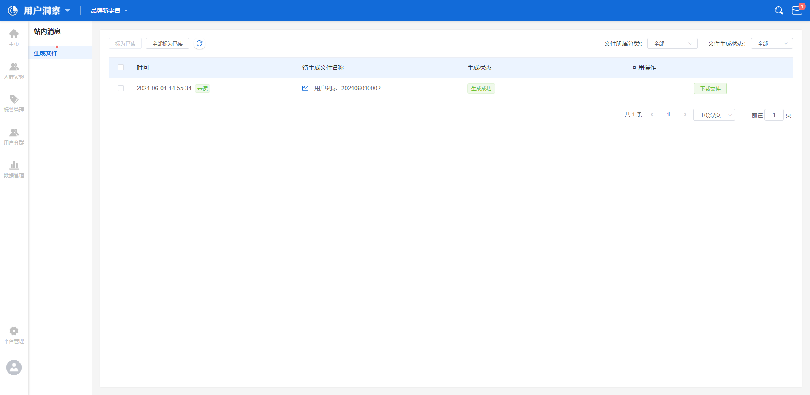
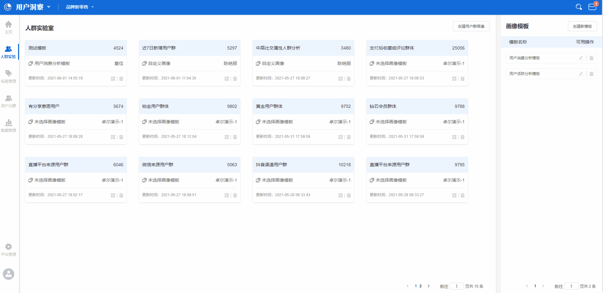
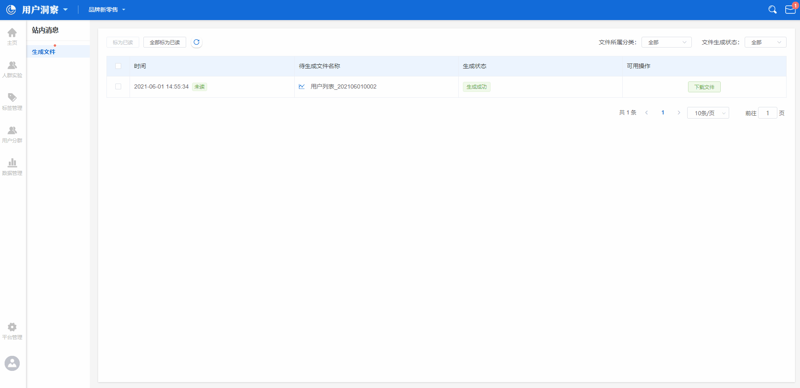
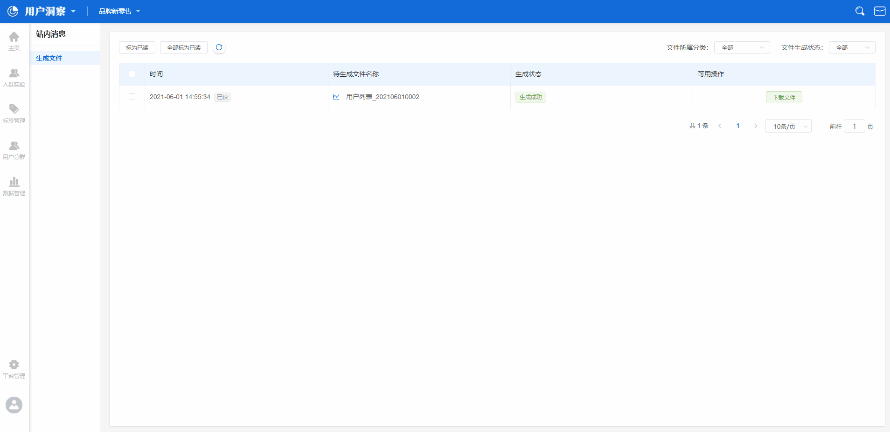
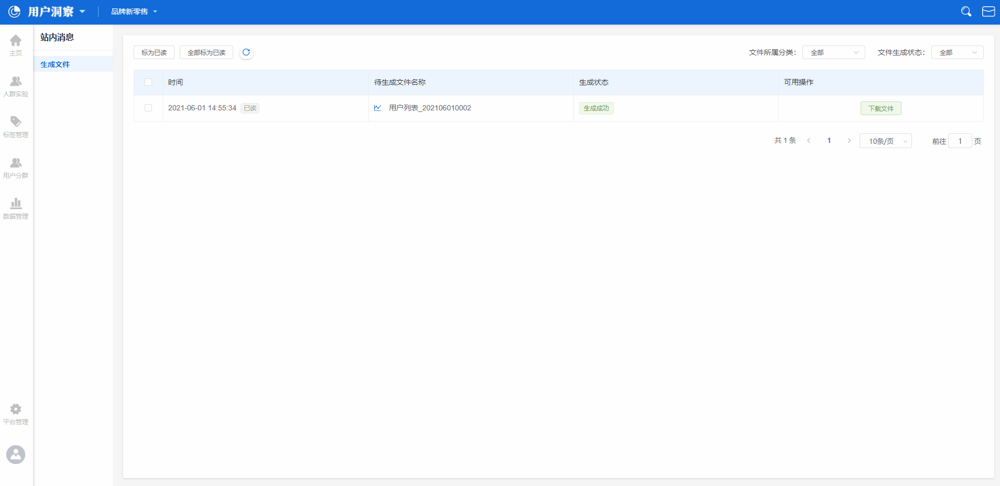

# 站内信

## 站内信界面概览

站内信，主要用于管理已经下载的数据文件，当在平台内任意一个功能模块中点击了**数据下载**按钮，平台会发送一条站内信，信内附带了**文件阅读状态**，**信息生成时间**，**生成的文件名称**，**文件生成状态**，**文件生成进度**五种信息。

## 进入站内信

在用户洞察平台全部界面的右上角，都设有消息中心的进入按钮，点击按钮后即可进入到消息中心的管理页面中。

## 管理站内信中的信息

### 切换状态

当一条站内信发送至账户内时，此条信息在站内信管理页面中的状态标签为**未读**，使用者可以点击左上角的**全部标记为已读**按钮修改所有站内信为已读状态，同时，点击单条站内信后方的**下载文件**按钮后，此条站内信将自动从维度转化为已读。

### 下载数据文件

点击单条站内信后方的**下载文件**按钮后，数据文件将以csv的格式下载至本地。

### 站内信筛选

站内信的筛选主要用两种方式：

* 文件所属分类筛选
* 文件生成状态筛选

点击下拉框后选择对应的筛选项，站内信列表将跟进筛选项自动切换展示内容。

## 相关状态说明

### 生成状态


文件生成中：正在生成对应的数据文件，生成进度在后方同步展示

生成完毕：数据文件已经生成成功，点击**下载文件**按钮即可开始下载

生成失败：数据文件生成失败


### 可用操作状态


生成中进度条：文件正在生成，此时将展示生成文件的进度条

下载文件：数据文件已经生成成功，点击**下载文件**按钮即可开始下载

已失效：数据文件超过保存有效期



文件的保存有效期为30天，超过30天文件将被删除

