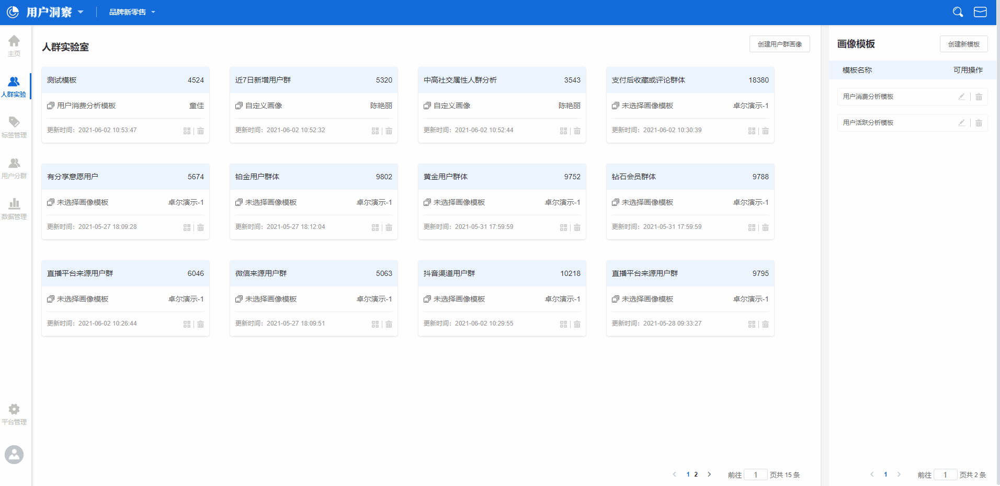

# 人群实验室

人群实验室，通过**标签分布数据**，**行为分布数据**，**特征分布数据**三大类数据，综合构建用户群的用户画像，通过对不同用户群的综合对比，深入且精细的对用户群进行洞察。

## 人群实验室界面概览

人群实验室主要由两部分功能组成：圈选人群与人群画像模板。


**圈选人群：**使用**用户属性**与**用户行为数据**来构建圈选判断条件，得出符合条件的用户群体。

**人群画像模板：**使用**标签分布数据**，**行为分布数据**，**特征分布数据**三类数据构建出的人群画像模板。


在初次使用用户洞察平台，进入人群实验室功能页面时，因为没有圈选过人群以及创建人群画像模板，所以此时界面没有数据，需要使用者根据需要来圈选人群及创建人群画像模板。

## 圈选人群

在人群实验室页面的右上角，点击**创建用户群画像**按钮，将人群圈选条件配置弹窗，可以在左上角进行命名。


此处圈选的用户群目的是构建人群画像，与用户分群创建的用户群非同一种


#### 用户特征


**用户特征**：指的是特定的用户属性，例如女性用户群，性别是用户属性的一种，女性是某个用户群的一个用户特征。


点击用户特征标题右侧的**增加特征**按钮，将弹出用户特征的配置区，主要结构为**用户属性/标签/人群-逻辑计算关系-属性值**。

在上述的例子中，筛选出女性用户，可以在用户特征配置区将条件配置为：

**性别-等于-女**

需要注意的是，用户属性具有不同的数据类型，根据数据类型的不同，可以选择的逻辑计算关系也有所不同，同时，选择标签或者人群作为特征配置条件时，逻辑计算关系也有所不同，详情请参照下表：

* 当选择用户属性作为特征配置条件时

| 数据类型    | 逻辑计算关系   | 配置示例                      |
| ------- | -------- | ------------------------- |
| 字符串类型   | 等于       | 性别-等于-女                   |
| 字符串类型   | 不等于      | 性别-不等于-女                  |
| 字符串类型   | 包含       | 首次渠道来源-包含-百度              |
| 字符串类型   | 不包含      | 首次渠道来源-不包含-百度             |
| 字符串类型   | 有值       | 首次渠道来源-有值                 |
| 字符串类型   | 没值       | 首次渠道来源-没值                 |
| 字符串类型   | 为空       | 首次渠道来源-为空                 |
| 字符串类型   | 不为空      | 首次渠道来源-不为空                |
| 字符串类型   | 正则匹配     | 常用设备-正则匹配-^Iphone         |
| 字符串类型   | 正则不匹配    | 常用设备-正则不匹配-^Iphone        |
| 字符串集合类型 | 包含       | 订阅频道-包含-科技                |
| 字符串集合类型 | 不包含      | 订阅频道-不包含-科技               |
| 字符串集合类型 | 为空       | 订阅频道-为空                   |
| 字符串集合类型 | 不为空      | 订阅频道-不为空                  |
| 字符串集合类型 | 有值       | 订阅频道-有值                   |
| 字符串集合类型 | 没值       | 订阅频道-没值                   |
| 数值类型    | 等于       | 会员等级-等于-1                 |
| 数值类型    | 不等于      | 会员等级-不等于-1                |
| 数值类型    | 小于       | 累计消费金额-小于-1000            |
| 数值类型    | 大于       | 累计消费金额-大于-1000            |
| 数值类型    | 有值       | 累计消费金额-有值                 |
| 数值类型    | 没值       | 累计消费金额-没值                 |
| 数值类型    | 区间       | 累计消费金额-区间-在1000至2000之间    |
| 日期时间类型  | 相对当前时间点  | 注册时间-相对当前时间点-过去-15天-之前    |
| 日期时间类型  | 相对当前时间区间 | 注册时间-相对当前时间区间-过去15天至30天之内 |
| 日期时间类型  | 绝对时间     | 注册时间-等于-2021/01/01        |
| 日期时间类型  | 有值       | 注册时间-有值                   |
| 日期时间类型  | 没值       | 注册时间-没值                   |
| 布尔类型    | 为真       | 是否接受推送-为真                 |
| 布尔类型    | 为假       | 是否接受推送-为假                 |
| 布尔类型    | 有值       | 是否接受推送-有值                 |
| 布尔类型    | 没值       | 是否接受推送-没值                 |

* 当选择标签或人群作为特征配置条件时

| 选择对象 | 逻辑计算关系    | 配置示例         |
| ---- | --------- | ------------ |
| 标签   | 等于        | 消费水平-等于-高水平  |
| 标签   | 不等于       | 消费水平-不等于-高水平 |
| 标签   | 有值        | 活跃程度-有值      |
| 标签   | 没值        | 活跃程度-没值      |
| 标签   | 为空        | 分享意愿-为空      |
| 标签   | 不为空       | 分享意愿-不为空     |
| 人群   | 为真（在人群内）  | 高价值客群-为真     |
| 人群   | 为假（不在人群内） | 高价值客群-为假     |

#### 行为满足


**行为满足：**指的是通过用户的行为数据，筛选出触发了特定行为的用户群体。


点击行为满足标题右侧的**增加行为**按钮，将弹出用户行为数据的配置区，主要结果为**元事件-事件指标/事件属性指标-逻辑计算关系-指标值**。

例如付费用户群，可以在用户行为数据配置区将条件配置为：​近30日-做过-支付订单-总次数-大于-1​


使用行为满足来圈选人群时，可选的事件指标只有总次数与均值，可选的事件属性指标只有数值类型属性的总和、均值、最大值与最小值，且可选的逻辑计算条件相同，配置条件枚举如下


| 逻辑计算关系 | 配置示例                                    |
| ------ | --------------------------------------- |
| 等于     | 近30日-做过-支付订单-总次数-等于-1                   |
| 不等于    | 近30日-做过-支付订单-总次数-不等于-1                  |
| 大于     | 近30日-做过-支付订单-订单金额总和-大于-1000             |
| 大于等于   | 近30日-做过-支付订单-订单金额总和-大于等于-1000           |
| 小于     | 近30日-做过-支付订单-订单金额总和-小于-1000             |
| 小于等于   | 近30日-做过-支付订单-订单金额总和-小于等于-1000           |
| 区间     | 近30日-做过-支付订单-订单金额总和-区间-1000至2000之间      |
| TOP    | 近30日-做过-支付订单-订单金额总和-前10位/后10位/前10%/后10% |

配置完成后，点击右小角的**开始分析**按钮，人群即圈选完成。

### 保存圈选人群样本

如动图所示，点击右上角的**保存**按钮，人群实验室的首页将以卡片的形式展示所有已经圈选完成的人群。

如果所示，按照顺序卡牌上的信息释义如下：


**人群名称：**对应图片上的序号1，表示此人群在圈选时的名称。

**人群包含用户数：**对应图片上的序号2，表示此人群在最近一次更新时包含的用户数总和。

**选择的画像模板：**对应图片上的序号3，表示此人群此时使用的画像模板。

**创建者：**对应图片上的序号4，表示此人群圈选时的账户名称。

**更新时间：**对应图片上的序号5，表示此人群最后一次更新完成时的时间点。



人群默认每天会计算一次包含的用户数，如果需要更新，可以点击**重新计算**按钮


### 将圈选人群保存为用户分群

完成人群圈选后，在人群详情页，可以点击上方的**保存**按钮，按钮点击后页面将弹出用户分群保存弹窗，使用者输入分群名称后，可以点击**确定**按钮，将圈选出的人群保存为用户分群。

### 下载圈选人群数据

如果需要将人群数据进行下载，可以点击页面上方的**下载**按钮，按钮点击后页面将弹出数据下载配置弹窗，使用者可以在弹窗左侧勾选需要下载的用户属性数据，并点击**>>**按钮，将勾选的属性数据移入弹窗右侧表示选中后，点击**开始下载**按钮即可将数据下载至本地。

## 开始圈选人群画像分析

在人群实验室中完成人群圈选配置，点击开始分析按钮后，页面会跳转至人群对比分析页面中。

在初始状态下，此时页面上会展示两个按钮，分别是**打开模板**与**直接增加分析指标**。


**打开模板：**点击后，页面右侧将弹出模板管理抽屉，使用者可以选择之前创建完成的**画像模板**直接进行分析。

**直接增加分析指标：**点击后，页面将弹出分析指标配置弹窗，使用者可以选择不同的指标并进行命名以构建人群画像。


### 打开模板


如果您之前没有创建过画像模板，需要先创建画像模板，才能在进行画像分析时直接使用模板


### 创建画像模板

.gif>)

在人群实验室的首页右上角，使用者可以点击**创建新模板**按钮来创建新的画像模板，进入新模板编辑页面后，在左上角可以为此模板命名，点击**增加分析指标**按钮，页面将弹出指标选择弹窗。

弹窗共有三部分组成：


**分析名称：**需要配置的分析指标的名称，例如活跃分布。

**分析类型：**共有标签分布情况，历史累计行为，特征分布结构三个可选项，点击任意一个以后，下方的条件配置区都会发生相应的变化。

**条件配置区：**用以配置分析指标，选择条件的功能区域。


#### 选择标签分布情况

使用者选择标签分布情况作为分析类型时，下方的条件配置区有两个选项：


**标签：**选择已经创建完成的某一个标签，如果未创建过标签，则需要在[标签管理](labelmanagement.md)中先完成标签创建。

**展现形式：**可以选择条形图或者饼环图。



例如已经创建了一个名为**活跃程度**的标签，标签值分别为**高活跃**，**中活跃**，**低活跃**三个值，此时需要分析在圈选的用户群体中，此标签的分布情况，可以在标签选项中选择活跃程度标签，展现形式选择条形图，点击生成分析后，结果将以条形图的形式展现在页面上。


#### 选择历史累计行为

使用者选择历史累计行为作为分析类型时，下方的条件配置区有三个选项：


**时间范围：**行为触发的时间范围，例如2021/01/01-2021/02/01。

**做过：**选择具体的行为与指标，此处可以选择行为的触发总次数或者行为携带的数值类型属性的总和，例如支付订单的总次数，或支付订单-订单金额-总和，**支付订单**为行为，**订单金额**为行为携带的数值类属性。

**展现形式：**可以选择条形图或者饼环图。


如果需要对数值展示进行自定义分组，可以点击图片上红圈处的齿轮按钮，选择自定义分组后，划定区间点击确定按钮即可将结果数值按照自定义的区间划分方式进行分组。


如需要分析圈选出的用户群体中，过去30天的复购情况，此时可以将条件配置为，过去30天-做过-支付订单事件-总次数，展现形式选择饼环图，点击生成分析后，结果将以饼环图的形式展现在页面上。


#### 选择特征分布结构

使用者选择特征分布结构作为分析类型时，下方的条件配置区有两个选项：


**行指标：**可以选择某个用户属性，或者已经创建完成的某个标签。

**列指标：**可以选择某个用户属性，或者已经创建完成的某个标签。



每个独立的画像模板中，使用特征分布结构作为分析类型的分析指标只能同时存在一个。



例如想要分析活跃程度与累计消费金额之间的特征分布结构，则可以在行指标处选择活跃程度标签，在列指标处选择累计消费金额，点击生成分析后，数据将以二维表格的形式展示在页面上。


全部分析指标配置完成之后，可以点击右上角的保存按钮，已经保存的画像模板将出现在画像模板管理抽屉中，使用者可以直接将保存好的画像模板拖动至圈选出的人群上方进行人群画像分析及人群对比分析。

### 直接增加分析指标

通过此种方式进行分析时，页面不会发生跳转，而是直接在原页面开始分析指标的创建，创建方式与创建画像模板的过程一致，此处不做赘述。

## 人群样本卡片的应用

### 拖动画像模板快捷分析

在人群实验室功能的主页面中，如果需要应用某个画像模板至已经保存的圈选人群样本时，可以直接将右侧的画像模板拖动至指定的圈选人群样本卡片上，点击开始实验按钮后，将立即开始圈选人群画像分析。

### 修改圈选人群

如果需要对已经保存的圈选人群做出修改，可以点击已保存圈选人群的标题，进入详情页后，点击左上角的**修改目标人群**按钮，页面将弹出人群圈选条件修抽屉，修改对应的圈选条件即可。


通过分析结果保存的圈选人群样本，不支持修改圈选条件


### 删除圈选人群

如果需要删除圈选人群，可以在人群实验室首页中，点击对应用户群卡片左下角的**删除**按钮，点击后页面将弹出删除的二次确认弹窗，点击**确认**将直接删除此圈选人群，点击**取消**将取消此次操作。


圈选人群删除后不可恢复，请谨慎操作。


## 已保存画像模板的修改

### 修改画像模板

如果需要对已经保存的画像模板做出修改，可以点击画像模板右侧的**编辑**按钮，点击后将进入到画像模板的详情页，同时修改页面状态为编辑态，对画像模板进行修改后，点击右上角的保存即可保存修改。

如果想要以已保存的画像模板为基础，修改后另存为一个新的画像模板，可以点击画像模板右侧的**编辑**按钮，点击后将进入到画像模板的详情页，同时修改页面状态为编辑态，修改画像模板的标题以及内部包含的分析指标后，点击另存为即可将修改后的结果保存为一个新的画像模板，同时已有的画像模板不会被改动。

### 删除画像模板

如果需要删除画像模板，可以点击画像模板右侧的**删除**按钮，点击后页面将弹出删除的二次确认弹出，点击**确认**后将直接删除此画像模板，点击**取消**将取消本次操作。


画像模板删除后不可恢复，请谨慎操作。

