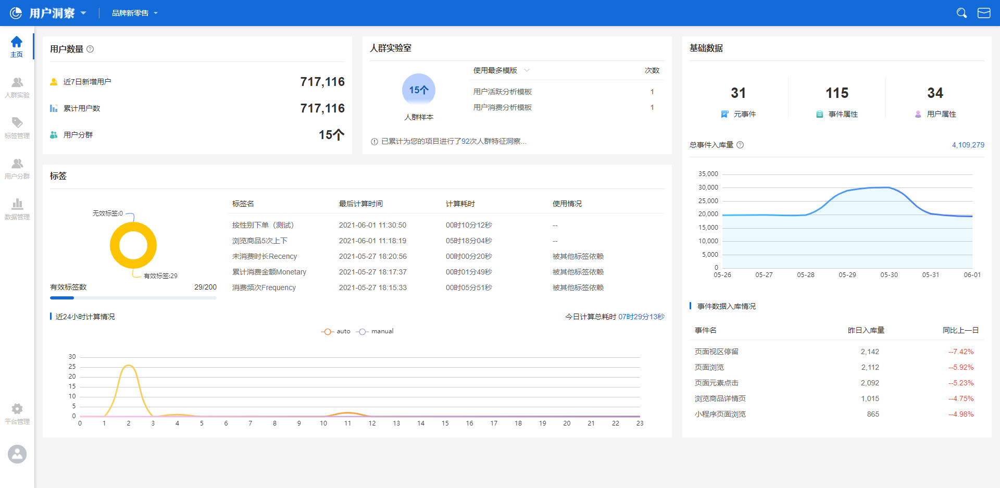
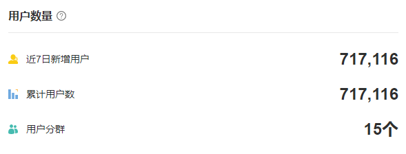
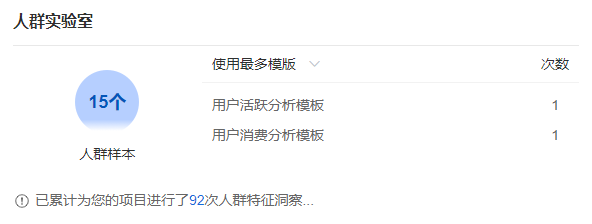
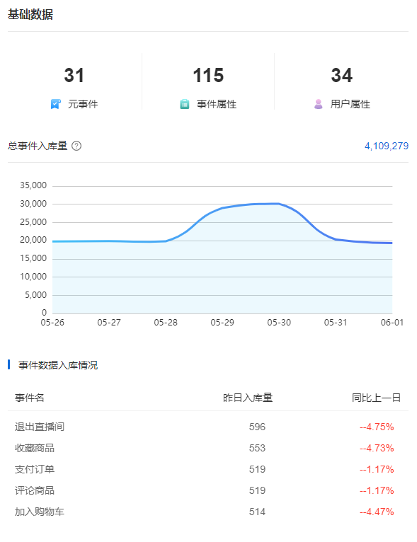
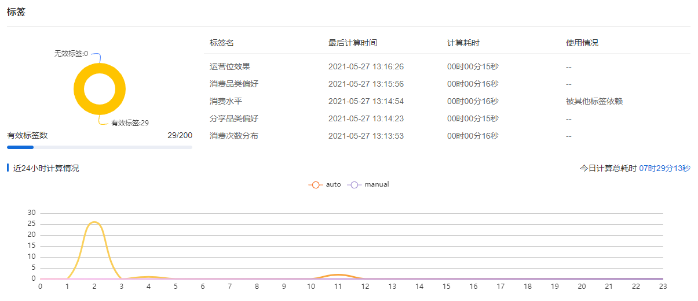

# 用户洞察面板

## 用户洞察面板界面概览

使用者使用平台登入用户洞察平台后，点击左侧菜单中的**首页**按钮，即可进入到用户洞察面板中，使用者可以通过用户洞察面板全盘观测目前平台的数据情况。

## 用户数量子面板

在用户洞察面板的左上角，设有用户数量的子面板，子面板中的各个指标释义如下：


近7日新增用户数：指的是最近7日（包含今日）的时间范围内，进入到产品的用户数，这个数量包含匿名用户（未注册用户）与实名用户（已注册用户）。

累计用户数：指的是接入平台的产品，从接入之日起，累计至今日的用户数量总和，同样包含匿名用户与实名用户。

用户分群：当前项目中包含的用户分群数量总和。



用户洞察平台使用ID-mapping方法，可以将用户注册登录前后的行为数据进行贯通，因此，使用者可能发现近7日新增用户数或累计用户数变小的情况，这是因为ID-mapping模块将用户匿名时产生的数据与实名后产生的数据进行了贯通，标识为一个用户导致的。


## 人群实验室子面板

人群实验室子面板的位置在用户洞察面板的正上方，子面板中各个指标的释义如下：


人群样本数：指的是当前项目中，已经保存的人群画像总数量。

使用最多的模板：指的是当前项目中，使用率最高的人群对比分析模板，子面板按使用次数从大到小的顺序展示前12个人群对比分析模板。

使用最少的模板：指的是当前项目中，使用率最低的人群对比分析模板，子面板按使用次数从小到大的顺序展示前12个人群对比分析模板。

累计洞察次数：指的是当前项目中，人群分析的总次数。


## 基础数据子面板

### 数据量面板

基础数据子面板位于用户洞察面板的右上角，子面板中各个指标的释义如下：


**元事件：**当前项目中的[元事件](../basicconcepts/events.md)总数。

**事件属性：**当前项目中的[事件属性](../basicconcepts/properties.md)总数。

**用户属性：**当前项目中的[用户属性](../basicconcepts/properties.md)总数。


### 事件入库量总和折线图

折线图展示近7日（包含今日）时间范围内，入库数据的总条数变化趋势情况。


事件入库量总和不是实时计算的，而是每个小时更新一次最新数据


### 事件数据入库情况轮播图

此处展示当前项目中，每个元事件在昨日入库的数据量总和，以及与昨日的前一日的对比数据。


**对比数据计算方法：**（单个事件昨日入库的数据量总和－单个事件昨日的前一日入库的数据量总和）/单个事件昨日的前一日入库的数据量总和


例如某个元事件A，昨日入库数据量为10000条，昨日的前一日入库数据量为8000条，则对比数据为：（10000-8000）/8000=25%

## 标签统计子面板

### 标签状态分布图

标签状态分布图位于标签统计子面板的左侧，主要展示有效标签、无效标签二者的对比情况，以及当前有效标签的数量情况。


**有效标签：**标签的显示状态为“显示”，会在每天自动计算的标签。

**无效标签：**标签的显示状态为“隐藏”或者已经超过有效期的标签。


### 标签计算情况轮播图

标签计算情况轮播图位于标签统计子面板的右上方，主要展示标签的**名称**，**最后计算时间**，**计算耗时**以及**使用情况**四个指标：


标签的名称：创建此标签时自定义的显示名称。

最后计算时间：此标签最后一次完成计算的时间点。

计算耗时：此标签最后一次计算耗费的时长。

使用情况：标签的被依赖状态



标签的被依赖状态主要有两种，分别是被其他标签依赖或者无状态：

**被其他标签依赖：**创建其他标签时使用了此标签。

**无状态：**没有被其他标签依赖，以“--”标识。


### 标签近24小时的计算情况折线图

此子面板位于标签统计子面板的下方，主要展示过去24小时的时间范围内，每小时计算的标签数量变化趋势情况，折线图分为自动计算与手动计算两条线。

### 标签今日计算总耗时

表示当日从00：00：00时开始到当前时间的标签自动计算总耗时。
