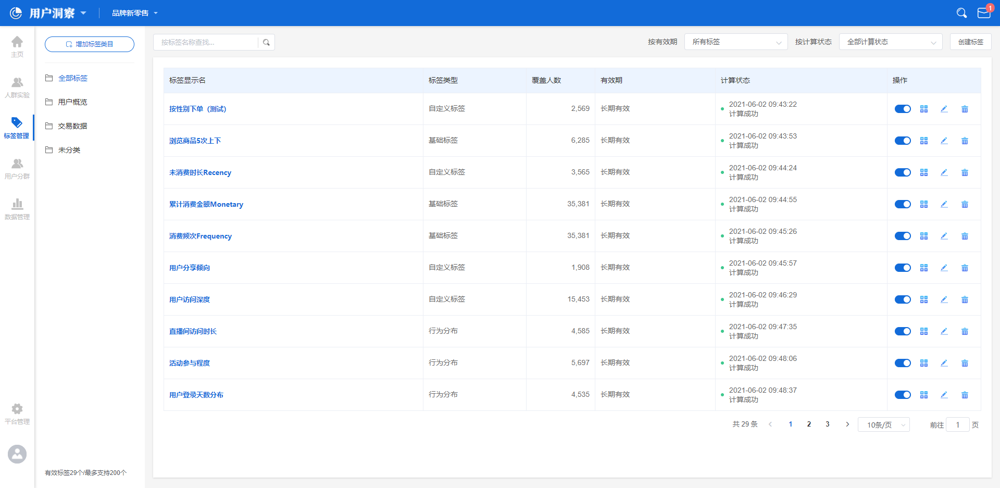
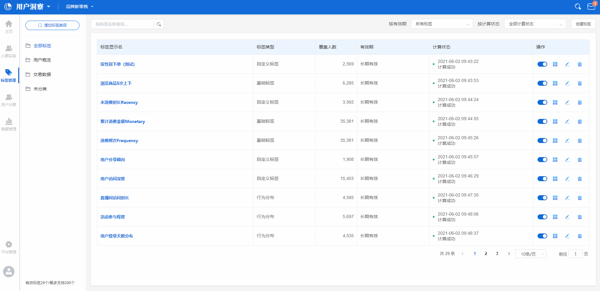
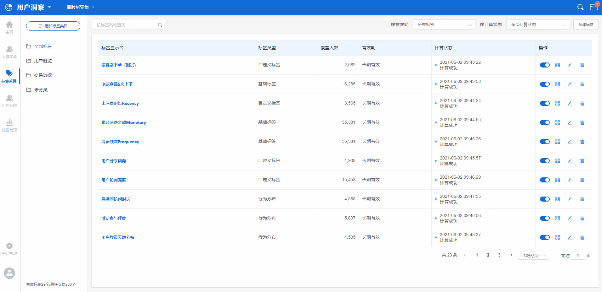
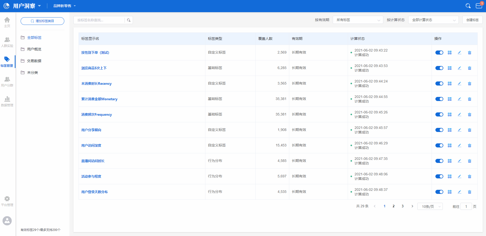
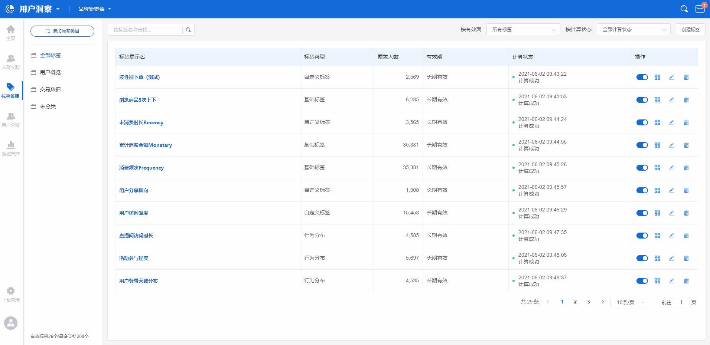
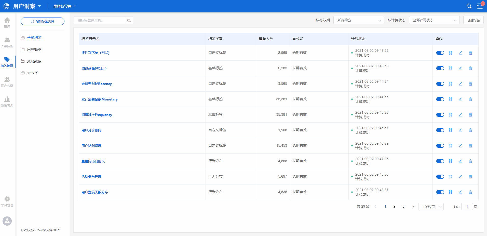

# 标签管理

标签管理，是用户洞察平台中有关标签内容的唯一入口，使用者可以点击左侧边栏的**标签管理**按钮进入到标签管理功能，解决创建标签，修改标签，标签归类等需求。

## 标签管理界面概览

标签管理界面由两部分组成，左侧部分为**标签类目列表**，目前支持的类目层级最大为二级，右侧为**选定标签类目下的全部标签列表**，总体来所，标签数据的结构为**一级标签类目>二级标签类目>标签**。

关于标签类目的概念，可以参考[标签](../basicconcepts/label.md)。

## 创建标签类目

在标签管理界面的标签类目列表上方，使用者可以点击**增加标签类目**按钮，点击后页面上方将弹出类目创建弹窗，此时分为两种情况：

### 创建一级标签类目

创建一级标签类目时，只需要在弹窗中填写标签类目名后点击确定即可。

### 创建二级标签类目

创建二级标签类目时，在弹窗中输入标签类目名称后，需要在一级标签类目下拉框中选择某个一级标签类目，点击确定即可完成二级标签类目的创建。

## 创建标签

在标签管理页面的右上角，使用者可以点击**创建标签**按钮，点击后页面将展开标签类型选择弹窗，选择需要创建的标签类型后，页面右侧将展开标签创建抽屉弹窗。

目前一共有五种标签类型，分别是**基础标签**，**行为偏好标签**，**行为分布标签**，**首次末次标签**以及**自定义标签**，使用者可以根据自身实际需求来选择创建的标签类型。

五种标签类型的创建抽屉弹窗，都是由**标签基础信息区**与**标签计算方法配置区**两个部分组成的，其中标签基础信息区的配置方法一致，下方列出了各配置项的释义：


**标签显示名：**标签在标签管理页面及用户洞察平台中的其他功能中应用时，用以显示的名称，支持中文，英文，符号与数字，标签显示名的长度最长为20个字。

**标签名称：**标签在存储时的名称，在标签管理页面及用户洞察平台中的其他功能应用时不会显示此名称，支持英文，数字与下划线，不支持中文与符合，长度限制为2-16位。

**所属类目：**此标签所属的一级类目或二级类目，如果还没有创建标签类目，此项可以不选。

**更新方式：**可选自动更新或者手动更新，自动更新的规则为每天更新一次。

**有效期：**可选长期有效或固定有效期，选择固定有效期时需要在右侧的时间范围选择器中设置标签失效的日期。

**备注信息：**此标签的特定说明信息。


### 创建基础标签

基础标签计算方法配置项的结构为：

 **时间范围-触发事件-指标-划分方式**

#### **配置计算时间范围**

在创建时，首先需要配置标签计算时的时间范围，点击标签计算方法配置区的时间范围选择器，可以选择时间范围，关于时间范围的详细说明，请参考[时间范围](../basicconcepts/timerange.md)。

#### **选择触发的事件**

接下来，需要选择触发的事件，点击事件选择器，下拉框中将展示全部[元事件](../basicconcepts/events.md)，根据需求选择某个元事件即可。

#### **选择事件指标**

指标的可选项为所选元事件的触发总次数，以及元事件携带的事件属性指标，事件属性的数据类型不同时，可选的指标也有所不同，详细枚举如下：

| 序号 | 可选指标                |
| -- | ------------------- |
| 1  | 所选元事件的总次数           |
| 2  | 元事件携带的数值类型属性的总和     |
| 3  | 元事件携带的数值类型属性的均值     |
| 4  | 元事件携带的数值类型属性的最大值    |
| 5  | 元事件携带的数值类型属性的最小值    |
| 6  | 元事件携带的数值类型属性的去重数    |
| 7  | 元事件携带的字符串类型属性的去重数   |
| 8  | 元事件携带的日期时间类型属性的去重数  |
| 9  | 元事件携带的布尔类型属性的去重数    |
| 10 | 元事件携带的字符串集合类型属性的去重数 |

指标选择完成之后，可以点击**增加筛选**按钮对已选择的指标进行筛选，具体的筛选规则请参考[属性筛选](../basicconcepts/screenfilter.md)。

#### 选择划分方式

* 按数值划分

选择按数值划分时，页面将展示如图所示的区间划分配置区，使用者可以自定义各区间的名称与区间划分规则。


例如需要配置消费金额标签，则可以将配置条件设置为：​近30日-做过支付订单事件-订单金额总和-按数值划分​

划分规则配置为：​


| 区间名称   | 区间配置 |     |
| ------ | ---- | --- |
| 低消费水平  | -∞   | 200 |
| 中低消费水平 | 200  | 400 |
| 中等消费水平 | 400  | 600 |
| 中高消费水平 | 600  | 800 |
| 高消费水平  | 800  | ＋∞  |


配置完成后，用户洞察平台将计算各个区间内的用户数据。


* 按离散值划分

选择按离散值划分时，无需其他配置，标签结果将直接按照离散值进行划分。


例如需要配置优惠券额度偏好标签，则可以将配置条件设置为：

**近30日-做过支付订单事件-使用的优惠券额度总和-按离散值划分**

配置完成后，用户洞察平台将计算各个区间内的用户数据。


* 按百分比划分

选择按百分比划分时，页面将展示如图所示的区间划分配置区，使用者同样可以自定义各区间的名称与区间划分规则。


例如需要活跃程度标签，则可以将配置条件设置为：​**近30日-做过App启动事件-总次数-按百分比划分​**

区间划分规则配置为：​


| 区间名称   | 区间配置 |      |
| ------ | ---- | ---- |
| 低活跃水平  | 0%   | 20%  |
| 中低活跃水平 | 20%  | 40%  |
| 中等活跃水平 | 40%  | 60%  |
| 中高活跃水平 | 60%  | 80%  |
| 高活跃水平  | 80%  | 100% |


​配置完成后，用户洞察平台将计算各个区间内的用户数据。


#### 人群预测

无论选择那种划分方式，在右侧都设有**人群预测**按钮，使用者可以点击此按钮来预计算当前规则下得到的结果，继而判断当前规则是否符合预期。

### 创建行为偏好标签

#### **配置计算时间范围**

在创建时，首先需要配置标签计算时的时间范围，点击标签计算方法配置区的时间范围选择器，可以选择时间范围，关于时间范围的详细说明，请参考[时间范围](../basicconcepts/timerange.md)。

#### **选择触发的事件**

接下来，需要选择触发的事件，点击事件选择器，下拉框中将展示全部[元事件](../basicconcepts/events.md)，根据需求选择某个元事件即可。

#### **选择事件指标**

配置行为偏好标签时，事件指标的配置结构为：

 元事件-事件属性-数值最大/出现次数最多-前N名的-事件属性

当所选事件属性的数据类型为数值类型时，结构中可选**数值最大**或**出现次数最多**。

当所选事件属性的数据类型为非数值类型时，结构中仅可选择**出现次数最多**。

指标选择完成之后，可以点击**增加筛选**按钮对已选择的指标进行筛选，具体的筛选规则请参考[属性筛选](../basicconcepts/screenfilter.md)。


例如需要分析用户退款行为中，退款最多的商品是哪些商品时，可以将配置条件设置为

**近30日-做过-订单退款-商品名称-出现次数最多-前10名的-商品名称**

配置完成后，用户洞察平台将计算订单退款行为中，用户退款最多的商品是哪10种。


#### 人群预测

点击右侧的**人群预测**按钮，使用者可以点击此按钮来预计算当前规则下得到的结果，获取当前规则的预计算结果。

### 创建行为分布标签

#### **配置计算时间范围**

在创建时，首先需要配置标签计算时的时间范围，点击标签计算方法配置区的时间范围选择器，可以选择时间范围，关于时间范围的详细说明，请参考[时间范围](../basicconcepts/timerange.md)。

#### **选择触发的事件**

接下来，需要选择触发的事件，点击事件选择器，下拉框中将展示全部[元事件](../basicconcepts/events.md)，根据需求选择某个元事件即可。

如果需要对触发事件进行属性筛选，可以点击**增加筛选**按钮对已选择的事件进行筛选，具体的筛选规则请参考[属性筛选](../basicconcepts/screenfilter.md)。

#### **选择时间聚合度以及区间**

触发事件选择完成之后，接下来需要配置行为分布的时间聚合度，使用者可以选择**按天**或**按小时**两种聚合方式，并且可以选择将结果按照离散值分布或按照自定义区间分布，总体结构为：​

**元事件-按天数/按小时数-的-自定义区间分布/离散值分布​**

当分布方式选择**离散值分布**时，结果将直接按照天数/小时数的计算结果开始离散值分布。

当分布方式选择**自定义区间分布**时，使用者需要先配置自定义的划分区间，并设置各个区间的名称。


例如想要分析最近7天的时间内，用户签到活动的参与天数情况，可以将配置设置如下：

**近7日-活动签到-按天数-的-离散值分布**

配置完成后，用户洞察平台将计算参与活动不同天数的用户分布情况：


#### 人群预测

点击右侧的**人群预测**按钮，使用者可以点击此按钮来预计算当前规则下得到的结果，获取当前规则的预计算结果。

### 创建首次末次标签

#### **配置计算时间范围**

在创建时，首先需要配置标签计算时的时间范围，点击标签计算方法配置区的时间范围选择器，可以选择时间范围，关于时间范围的详细说明，请参考[时间范围](../basicconcepts/timerange.md)。

#### **选择触发事件**

接下来，需要选择触发的事件，点击事件选择器，下拉框中将展示全部[元事件](../basicconcepts/events.md)，根据需求选择某个元事件即可。

如果需要对触发事件进行属性筛选，可以点击**增加筛选**按钮对已选择的事件进行筛选，具体的筛选规则请参考[属性筛选](../basicconcepts/screenfilter.md)。

#### **设置首次末次条件**

配置首次末次标签时，总体的配置结构为：​时间范围-触发事件-首次发生/末次发生-具体时间点/距离当前日期天数/事件属性


**具体时间点：**指的是用户首次/末次触发选择的触发事件时的时间点，时间精度为yyyy-mm-dd

**距离当前日期天数：**指的是用户首次/末次触发选择的触发事件时，距离当前时间的完整天数，例如当前日期为2021/01/07，用户首次触发的时间点为2021/01/01，则距离当前日期天数为6天。

**事件属性：**指的是用户首次/末次触发选择的触发事件时，此事件携带的某个事件属性的分布。



例如想要分析用户末次支付订单距离当前日期天数的分布，可以将配置条件设置为：

​**上线至今-支付订单-末次发生-距离当前日期天数​**

配置完成后，用户洞察平台将计算出结果。


#### 人群预测

点击右侧的**人群预测**按钮，使用者可以点击此按钮来预计算当前规则下得到的结果，获取当前规则的预计算结果。

### 创建自定义标签

#### **设置标签分组**

配置自定义标签时，根据单个标签需要的独立分组个数与各个分组的名称，进行标签分组设置。

* 创建新标签分组

点击**创建新分组规则**，即可增加一个标签独立分组。

* 设置标签分组名称

标签分组名称默认为**分组+序号**，例如分组1、分组2、分组3，点击默认名称，即可对标签分组名称进行修改。

#### **设置每个独立组内的配置条件**

* 选择用户特征


**用户特征：**指的是特定的用户属性，例如女性用户群，性别是用户属性的一种，女性是某个用户群的一个用户特征。


点击用户特征标题右侧的**增加特征**按钮，将弹出用户特征的配置区，主要结构为：​

**用户属性/标签/人群-逻辑计算关系-属性值​**

在上述的例子中，筛选出女性用户，可以在用户特征配置区将条件配置为：​

**性别-等于-女​**

需要注意的是，用户属性具有不同的数据类型，根据数据类型的不同，可以选择的逻辑计算关系也有所不同，同时，选择标签或者人群作为特征配置条件时，逻辑计算关系也有所不同，详情请参考人群实验室章节，[圈选人群的用户特征](crowdlaboratory.md#quan-xuan-ren-qun)部分。

* 选择用户行为


**行为满足：**指的是通过用户的行为数据，筛选出触发了特定行为的用户群体。


点击行为满足标题右侧的**增加行为**按钮，将弹出用户行为数据的配置区，主要结果为**元事件-事件指标/事件属性指标-逻辑计算关系-指标值**。

例如付费用户群，可以在用户行为数据配置区将条件配置为：

**近30日-做过-支付订单-总次数-大于-1**

| 逻辑计算关系 | 配置示例                                    |
| ------ | --------------------------------------- |
| 等于     | 近30日-做过-支付订单-总次数-等于-1                   |
| 不等于    | 近30日-做过-支付订单-总次数-不等于-1                  |
| 大于     | 近30日-做过-支付订单-订单金额总和-大于-1000             |
| 大于等于   | 近30日-做过-支付订单-订单金额总和-大于等于-1000           |
| 小于     | 近30日-做过-支付订单-订单金额总和-小于-1000             |
| 小于等于   | 近30日-做过-支付订单-订单金额总和-小于等于-1000           |
| 区间     | 近30日-做过-支付订单-订单金额总和-区间-1000至2000之间      |
| TOP    | 近30日-做过-支付订单-订单金额总和-前10位/后10位/前10%/后10% |

例如业务上需要创建根据来源渠道以及消费水平高低的数据所建立的标签，可以将配置条件设置为：

* 分组名称设置

按顺序分别为：微博-高消费；微博-中消费；微博-低消费；巨量引擎-高消费；巨量引擎-中消费；巨量引擎-低消费。

* 各分组计算规则配置

| 组别       | 配置类型   | 配置条件                                |
| -------- | ------ | ----------------------------------- |
| 微博-高消费   | 用户特征配置 | 首次来源渠道-等于-微博                        |
| 微博-高消费   | 行为满足配置 | 过去30天-做过-支付订单事件-订单金额总和-大于5000       |
| 微博-中消费   | 用户特征配置 | 首次来源渠道-等于-微博                        |
| 微博-中消费   | 行为满足配置 | 过去30天-做过-支付订单事件-订单金额总和-区间-2500至5000 |
| 微博-低消费   | 用户特征配置 | 首次来源渠道-等于-微博                        |
| 微博-低消费   | 行为满足配置 | 过去30天-做过-支付订单事件-订单金额总和-小于2500       |
| 巨量引擎-高消费 | 用户特征配置 | 首次来源渠道-等于-巨量引擎                      |
| 巨量引擎-高消费 | 行为满足配置 | 过去30天-做过-支付订单事件-订单金额总和-大于5000       |
| 巨量引擎-中消费 | 用户特征配置 | 首次来源渠道-等于-巨量引擎                      |
| 巨量引擎-中消费 | 行为满足配置 | 过去30天-做过-支付订单事件-订单金额总和-区间-2500至5000 |
| 巨量引擎-低消费 | 用户特征配置 | 首次来源渠道-等于-巨量引擎                      |
| 巨量引擎-低消费 | 行为满足配置 | 过去30天-做过-支付订单事件-订单金额总和-小于2500       |

配置完成后，用户洞察平台将计算出结果。

#### **人群预测**

点击右侧的**人群预测**按钮，使用者可以点击此按钮来预计算当前规则下得到的结果，获取当前规则的预计算结果。

## 已创建标签的编辑

### 搜索标签

在标签管理的主页面，使用者可以通过左上角的搜索框对标签进行搜索，在搜索框内输入关键词后键入回车键，标签展示列表将根据输入的关键词展示搜索后符合条件的结果。

如果搜索后页面展示**暂无数据**，说明目前已经保存的所有标签中，没有标签名称与输入的关键词可以匹配。

### 筛选标签

#### **通过有效期进行筛选**

在标签管理页的右上方，使用者可以点击**有效期筛选下拉框**对全部标签进行筛选，下拉框中共有四个选项：


**所有有效标签：**指的是已经保存的全部标签中，标签的状态为有效的标签。

**长期标签：**指的是已经保存的全部标签中，在创建时，标签有效期选择**长期有效**的标签。

**短期标签：**指的是已经保存的全部标签中，在创建时，标签有效期选择**有效期至-某时间点**的标签。

**过期标签：**指的时已经保存的全部标签中，当前日期已经超过标签有效期的标签。


点击有效期筛选下拉框中的某个选项之后，下方的标签列表将按照筛选的选项进行展示。

#### **通过计算状态进行筛选**

在标签管理页的右上方，使用者可以点击**计算状态筛选下拉框**对全部标签进行筛选，下拉框中共有五个选项：


**所有：**指的是不经过筛选，展示全部标签，这也是计算状态筛选下拉框的默认状态。

**待计算：**指的是处于计算队列中靠后的，没有进入计算状态的标签。

**计算中：**指的是处于计算队列中，已经进入计算状态的标签。

**计算成功：**指已经完成计算的标签。

**计算失败：**指计算过程出现错误，计算失败的标签。


点击有效期筛选下拉框中的某个选项之后，下方的标签列表将按照筛选的选项进行展示。

### 修改标签的启用状态

在标签管理页面中，每个独立标签的右侧都设有**计算状态开关**，当开关状态为开启时，标签将按照计算规则定期完成更新计算，当开关状态为关闭时，标签则不会进行更新计算。

### 重新计算标签

如果需要立即更新标签的数据，可以在标签列表中点击需要更新标签右侧的**重新计算**按钮，点击后此标签的数据将立即计算一次，完成更新。

### 编辑标签

如果需要对已经保存的标签重新编辑，可以点击需要编辑标签右侧的**编辑**按钮，点击后页面右侧将弹出表填的编辑抽屉弹窗，对需要修改的条件修改后点击右下角的**确认**按钮即可。


对已经保存的标签进行编辑时，标签名称不可修改。



因为在数据库内保存的标签数据具有一定的数据类型，为了避免因为重新编辑标签导致标签数据类型发生改变，从而被数据清洗模块过滤，所以在编辑已保存标签时，一些条件是不可改变的，界面上表现为该条件被禁用。


### 删除标签

如果需要删除已保存的标签，可以在标签列表中点击需要更新标签右侧的**删除**按钮，点击后页面将弹出删除的二次确认弹出，点击弹出中的**确认**后，此标签的数据将被立即删除。


标签删除后数据无法恢复，请谨慎操作。

