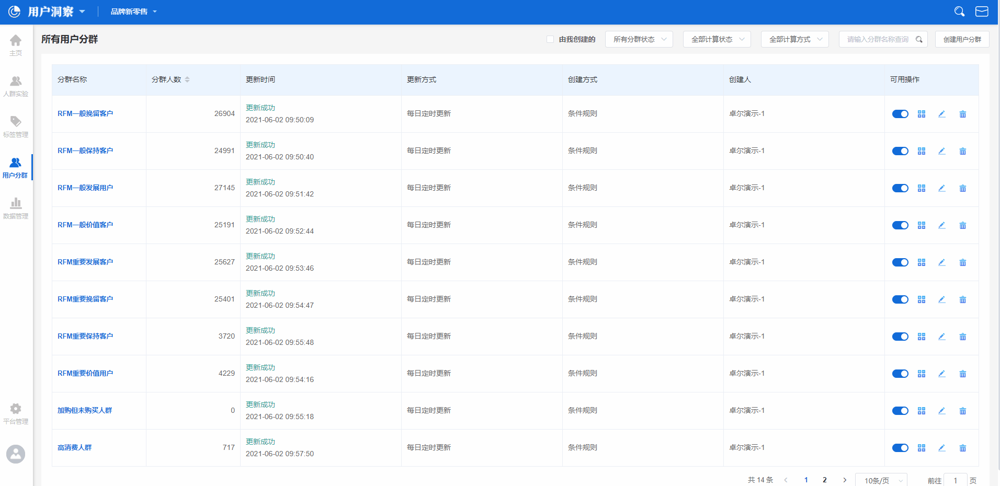
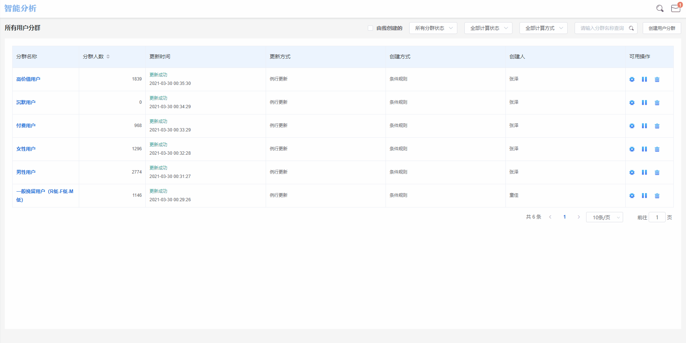
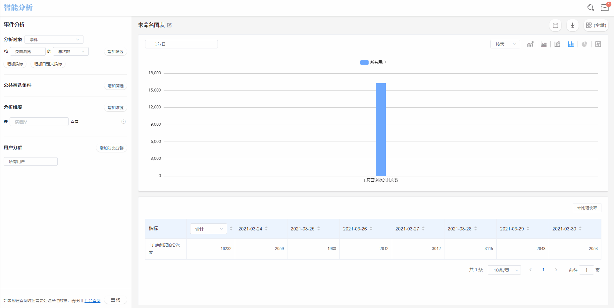

# 用户分群

用户分群不同于[人群实验室](crowdlaboratory.md)中的圈选人群，用户分群可以用于圈选人群，可以用以人群对比分析，二者从功能的应用方向上是不同的。

## 用户分群界面概览

用户分群界面由上下两个部分组成，上方为**功能区**，下方为**分群管理区**。


**功能区：**主要执行分群的搜索，筛选，创建功能。

**分群管理区：**主要执行分群数据概览，分群状态修改，编辑与删除功能。


## 分群的搜索

在用户分群主界面的左上角搜索框内，使用者可以通过输入关键词的方式对已创建的用户分群进行搜索。

搜索的过程是针对分群名称进行搜索，支持模糊搜索，使用者输入关键词后键入回车键，下方将直接展示搜索后的结果，如果显示**暂无数据**，则说明目前没有分群的名称可以与搜索框内的关键词匹配。

## 分群的筛选

### 按分群状态筛选

分群状态主要分为**正常运行**与**暂停中**两种状态，由分群的状态开关来控制，分群状态开关为开启状态时，分群的状态为正常运行，反之则为暂停中。

通过分群状态筛选下拉框，可以对上述两种状态进行筛选：


**所有分群状态：**下方展示所有用户分群。

**正常运行：**下方展示分群状态为开启的用户分群。

**暂停中：**下方展示分群状态为关闭的用户分群。


### 按计算状态筛选

分群的计算状态主要分为**计算完成**、**计算失败**与**等待计算**三种状态，状态由分群的计算情况决定，当平台根据用户分群的规则，计算完成此分群内包含的用户时，状态为计算完成，如果遇到逻辑错误，状态为计算失败，如果分群处于计算队列相对靠后的位置时，状态为等待计算。

通过计算状态下拉框，可以对上述三种状态进行筛选：


**所有计算状态：**下方展示所有用户分群。

**计算完成：**下方展示计算状态为计算完成的用户分群。

**计算失败：**下方展示计算状态为计算失败的用户分群。

**等待计算：**下方展示计算状态为等待计算的用户分群。


### 按创建方式筛选

.gif>)

分群的创建方式主要分为**条件规则创建**、**分析结果保存**与**ID上传**三种状态，状态由创建分群时选择的创建分群方式决定，三种创建方式对应了三种分群状态。

通过创建方式筛选下拉框，可以对上述三种状态进行筛选：


**所有创建方式：**下方展示所有用户分群。

**条件规则创建：**下方展示创建方式为条件规则创建的用户分群。

**分析结果保存：**下方展示创建方式为分析结果保存的用户分群。

**ID上传创建：**下方展示创建方式为ID上传的用户分群。


## 用户分群界面管理区各标签释义


**分群名称：**创建分群时自定义命名的分群名称。

**分群人数：**最后一次计算完成后，此用户分群的人数。

**更新时间：**此分群最后一次完成计算的时间点与此时的分群计算状态。

**更新方式：**创建分群时选择的更新方式。

**创建方式：**此分群完成创建时使用的创建方式。

**创建人：**此分群完成创建时的账户名。


## 创建用户分群

### 条件规则创建

在用户分群界面的右上角，使用者可以点击**创建用户分群**按钮，并选择**条件规则创建**的方式来创建一个新的用户分群，点击后页面右侧将弹出用以创建分群的抽屉，抽屉由四个个部分组成：


**分群名称：**自定义的分群名称。

**更新方式：**手动更新或例行按天更新。

**用户特征：**指的是特定的用户属性，例如女性用户群，性别是用户属性的一种，女性是某个用户群的一个用户特征。

**行为满足：**指的是通过用户的行为数据，筛选出触发了特定行为的用户群体。


#### 配置用户特征

点击用户特征标题右侧的**增加特征**按钮，将弹出用户特征的配置区，主要结构为**用户属性/标签/人群-逻辑计算关系-属性值**。

在上述的例子中，筛选出女性用户，可以在用户特征配置区将条件配置为：

​**性别-等于-女​**

需要注意的是，用户属性具有不同的数据类型，根据数据类型的不同，可以选择的逻辑计算关系也有所不同，同时，选择标签或者人群作为特征配置条件时，逻辑计算关系也有所不同，详情请参照下表：

* 当选择用户属性作为特征配置条件时

| 数据类型    | 逻辑计算关系   | 配置示例                      |
| ------- | -------- | ------------------------- |
| 字符串类型   | 等于       | 性别-等于-女                   |
| 字符串类型   | 不等于      | 性别-不等于-女                  |
| 字符串类型   | 包含       | 首次渠道来源-包含-百度              |
| 字符串类型   | 不包含      | 首次渠道来源-不包含-百度             |
| 字符串类型   | 有值       | 首次渠道来源-有值                 |
| 字符串类型   | 没值       | 首次渠道来源-没值                 |
| 字符串类型   | 为空       | 首次渠道来源-为空                 |
| 字符串类型   | 不为空      | 首次渠道来源-不为空                |
| 字符串类型   | 正则匹配     | 常用设备-正则匹配-^Iphone         |
| 字符串类型   | 正则不匹配    | 常用设备-正则不匹配-^Iphone        |
| 字符串集合类型 | 包含       | 订阅频道-包含-科技                |
| 字符串集合类型 | 不包含      | 订阅频道-不包含-科技               |
| 字符串集合类型 | 为空       | 订阅频道-为空                   |
| 字符串集合类型 | 不为空      | 订阅频道-不为空                  |
| 字符串集合类型 | 有值       | 订阅频道-有值                   |
| 字符串集合类型 | 没值       | 订阅频道-没值                   |
| 数值类型    | 等于       | 会员等级-等于-1                 |
| 数值类型    | 不等于      | 会员等级-不等于-1                |
| 数值类型    | 小于       | 累计消费金额-小于-1000            |
| 数值类型    | 大于       | 累计消费金额-大于-1000            |
| 数值类型    | 有值       | 累计消费金额-有值                 |
| 数值类型    | 没值       | 累计消费金额-没值                 |
| 数值类型    | 区间       | 累计消费金额-区间-在1000至2000之间    |
| 日期时间类型  | 相对当前时间点  | 注册时间-相对当前时间点-过去-15天-之前    |
| 日期时间类型  | 相对当前时间区间 | 注册时间-相对当前时间区间-过去15天至30天之内 |
| 日期时间类型  | 绝对时间     | 注册时间-等于-2021/01/01        |
| 日期时间类型  | 有值       | 注册时间-有值                   |
| 日期时间类型  | 没值       | 注册时间-没值                   |
| 布尔类型    | 为真       | 是否接受推送-为真                 |
| 布尔类型    | 为假       | 是否接受推送-为假                 |
| 布尔类型    | 有值       | 是否接受推送-有值                 |
| 布尔类型    | 没值       | 是否接受推送-没值                 |

* 当选择标签或人群作为特征配置条件时

| 选择对象 | 逻辑计算关系 | 配置示例         |
| ---- | ------ | ------------ |
| 标签   | 等于     | 消费水平-等于-高水平  |
| 标签   | 不等于    | 消费水平-不等于-高水平 |
| 标签   | 有值     | 活跃程度-有值      |
| 标签   | 没值     | 活跃程度-没值      |
| 标签   | 为空     | 分享意愿-为空      |
| 标签   | 不为空    | 分享意愿-不为空     |

#### 行为满足


**行为满足：**指的是通过用户的行为数据，筛选出触发了特定行为的用户群体。


点击行为满足标题右侧的**增加行为**按钮，将弹出用户行为数据的配置区，主要结果为**元事件-事件指标/事件属性指标-逻辑计算关系-指标值**。

例如付费用户群，可以在用户行为数据配置区将条件配置为：​

**近30日-做过-支付订单-总次数-大于-1​**


使用行为满足来创建用户分群时，可选的事件指标只有总次数与均值，可选的事件属性指标只有数值类型属性的总和、均值、最大值与最小值，且可选的逻辑计算条件相同，配置条件枚举如下


| 逻辑计算关系 | 配置示例                                    |
| ------ | --------------------------------------- |
| 等于     | 近30日-做过-支付订单-总次数-等于-1                   |
| 不等于    | 近30日-做过-支付订单-总次数-不等于-1                  |
| 大于     | 近30日-做过-支付订单-订单金额总和-大于-1000             |
| 大于等于   | 近30日-做过-支付订单-订单金额总和-大于等于-1000           |
| 小于     | 近30日-做过-支付订单-订单金额总和-小于-1000             |
| 小于等于   | 近30日-做过-支付订单-订单金额总和-小于等于-1000           |
| 区间     | 近30日-做过-支付订单-订单金额总和-区间-1000至2000之间      |
| TOP    | 近30日-做过-支付订单-订单金额总和-前10位/后10位/前10%/后10% |

条件配置完成后，点击右下加的**创建**按钮，即完成了用户分群的创建。

例如想要创建一个**女性高活跃消费水平TOP10**的用户分群，可以在用户特征中进行如下配置：​性别-等于-女&活跃程度-等于-高活跃​

同时在行为满足中进行如下配置：​近7日-做过-支付订单-订单金额的总和-TOP-前10名​

此时创建出的用户分群即为女性高活跃且消费水平为TOP10的用户分群。

### ID上传创建

当选择**ID上传创建**的方式时，页面右侧会弹出用户分群创建时的抽屉弹窗，抽屉由两个部分组成：


**分群名称：**自定义的分群名称。

**ID文件：**使用者自定义的用户ID组文件，文件需为txt格式，文件内为用户ID信息，一行一个用户ID。


使用者可以先点击**下载模板**按钮，点击后模板文件将被下载至本地，对其进行编辑后保存，之后点击**点击上传**按钮，将弹出文件选择器，选择刚才修改保存号的用户ID文件，进行上传后，点击右下角的**提交**按钮，即可完成用户分群的创建。


ID上传创建用户分群时，不需要配置更新方式，且无法更新。


### 分析结果保存

在用户洞察平台中，任意查询结果为用户数数值的表格中，可以点击此用户数，在弹出的菜单中点击**保存用户分群**，之后在弹出的窗口中输入分群名称，点击**确定**后即可完成用户分群的创建。


分析结果保存为用户分群时，不需要配置更新方式，且无法更新。


## 编辑用户分群

### 修改分群的启动状态

在用户分群界面的**分群管理区**中，点击需要修改分群右侧的**分群状态**开关，可以切换分群的状态，分群状态开关为开启状态时，分群的状态为正常运行，按照分群的更新规则进行更新，反之则为暂停中，分群的数据会暂停更新。

### 手动更新分群的数据

如果需要立即更新分群的数据，可以点击**重新计算**按钮，分群将开始重新计算数据。

### 修改分群的配置条件

点击需要修改分群右侧的**修改**按钮，即可对此分群的配置条件进行修改，修改的过程根据分群创建时使用的创建方式不同有所不同：


**条件规则创建：**可以修改分群名称，更新方式，配置条件

**ID上传：**只可以修改分群名称

**分析结果保存创建：**只可以修改分群名称


### 删除用户分群

如果需要删除某个已经创建的分群，可以点击其右侧的**删除**按钮，点击后页面将弹出删除的二次确认弹窗，点击弹窗中的**确认**按钮，即可删除分群。


分群删除后不可恢复，请谨慎操作


## 查看用户分群详情数据

在用户分群主界面中，点击需要查看详细数据的分群标题，即可进入此分群的详情数据页面中，页面由两个部分组成，上方的**数据概览**，下方的**用户详情列表**。

### 用户分群详情页数据概览释义


**用户分群名称：**对应图片上的序号1，表示此分群在创建时自定义的分群名称。

**人群用户数：**对应图片上的序号2，结构为{当前分群用户数/总用户数}，此数据在每次分群更新后发生变化。

**在全部用户中占比：**对应图片上的序号3，表示当前用户分群中的用户数，在全部用户数中的占比。

**最后计算时间：**对应图片上的序号4，表示此分群最后一次计算完成时的时间点。

**数据时间范围选择器：**对应图片上的序号5，通过此选择器可以切换展示数据的时间范围，时间范围的边界为此分群创建时的日期至今。

**用户数量变化趋势图：**对应图片上的序号6，表示此用户群的用户数，在选定时间范围内的变化趋势情况，使用者可以点击折线图上的数据点，切换下方数据表展示不同历史日期的详细数据。


### 配置用户详情列表中展示的数据

在用户分群详情页中，使用者可以点击右上方的**设置显示列**按钮，点击后页面将弹出展示列配置弹窗，在弹窗左侧勾选需要展示的用户属性后，点击**>>**按钮将其移入右侧，点击保存后即可完成用户详情列表展示数据的配置。

### 下载用户分群数据

在用户分群详情页中，使用者可以点击右上方的**下载人群包**按钮，点击后此分群数据将被下载至本地。

## 查看单个用户的行为数据

在用户分群详情页中，可以点击某个具体的用户ID，来查看其行为数据，点击后页面将跳转至单个用户的行为数据详情页。

页面由四个部分组成，分别是左上角的**行为数量趋势图**，右上角的**行为分布**，左下方的**行为序列数据**以及右下方的**用户属性数据**。


**行为数据趋势图：**表示此用户在选定的时间范围内，行为数量随时间变动的趋势情况。

**行为分布：**表示此用户触发的全部行为中，各个独立行为的分布情况。

**行为序列数据：**表示此用户在选定的时间范围内，按时间排列的全部行为序列数据。

**用户属性数据：**表示此用户的全部用户属性数据。


### 切换时间范围

点击详情页上方的时间范围选择器，可以对数据范围进行切换，完成切换后，下方展示的全部数据将按照新的时间范围重新计算展示。

### 全局事件筛选

点击详情页上方的事件筛选器，可以选择某个特定的事件进行展示，点击后下拉框中将展示全部的元事件，点击需要单独展示的事件后，页面全部数据将按照筛选出的事件进行重新计算展示。

### 行为序列中事件的定位展示

点击详情页左下方的**定位到指定事件**下拉框，可以选择行为序列中某个特定的事件进行展示，点击后下拉框中将展示行为序列中所有事件的去重结果，点击需要单独展示的事件后，行为序列数据将按照筛选出的事件进行重新计算展示。

如果需要清除筛选，可以点击定位到指定事件左侧的**刷新**按钮，点击后行为序列数据将进行刷新，同时清除筛选。
